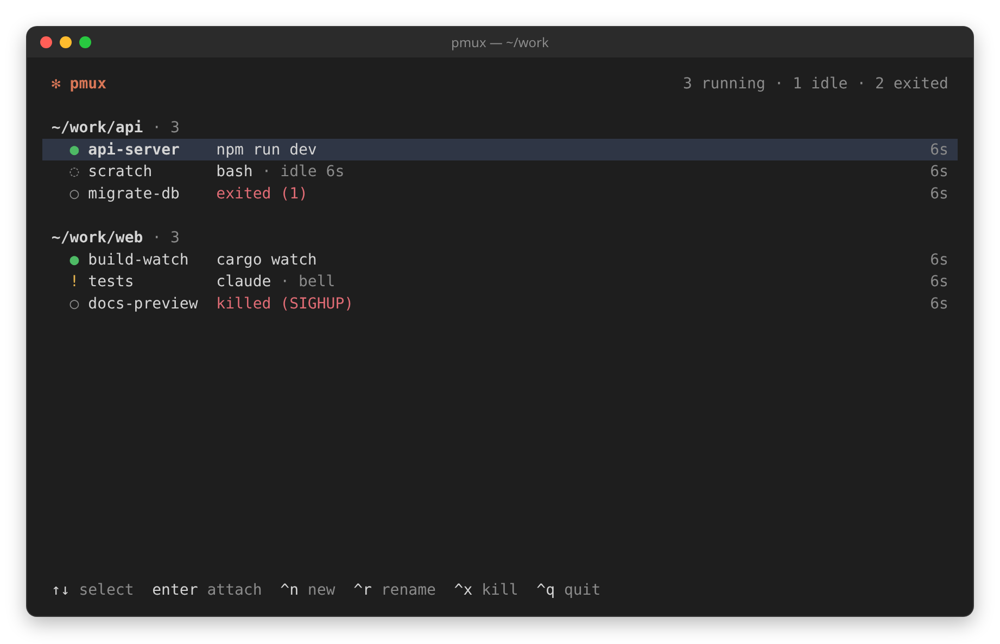
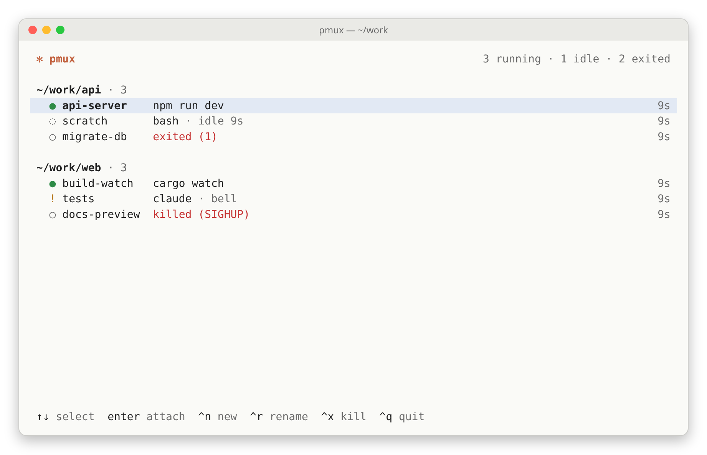
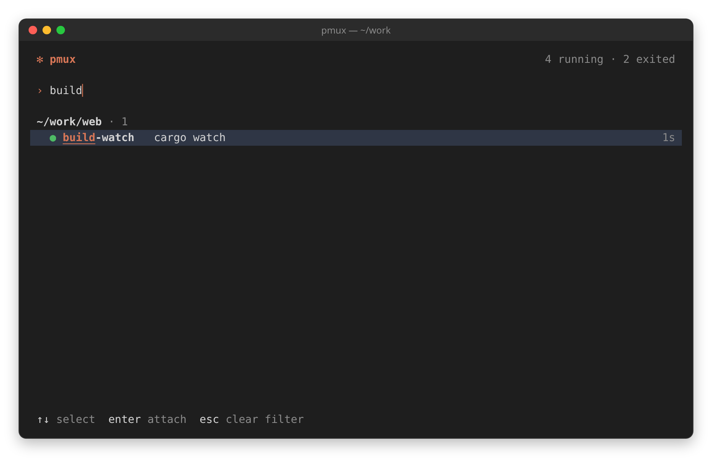
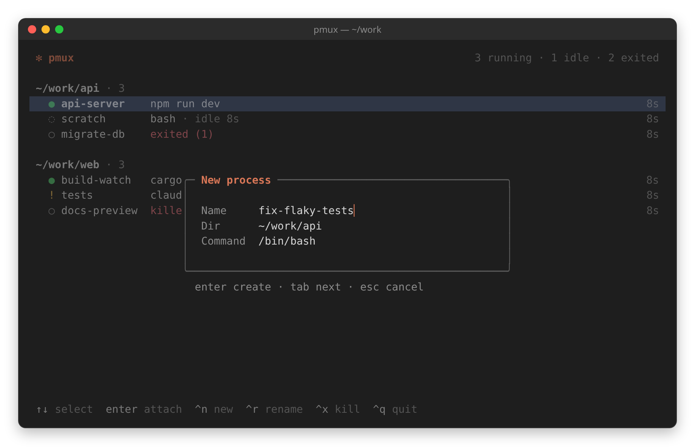
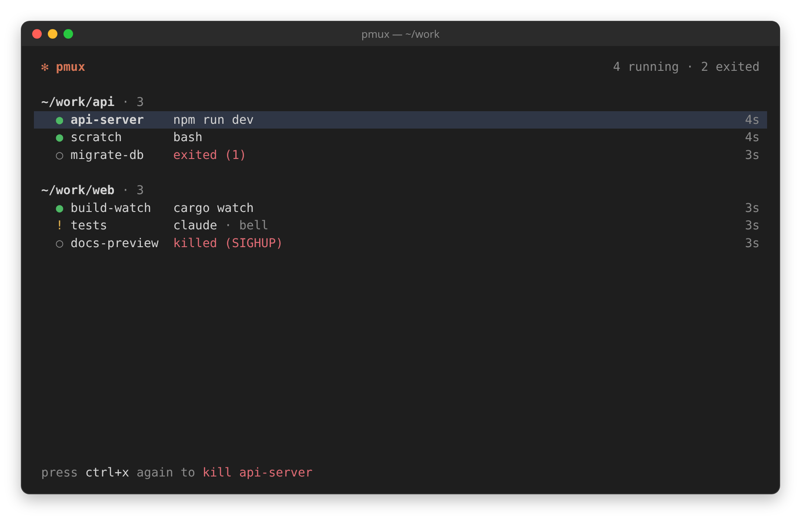

# pmux

A terminal process multiplexer. It keeps long-running processes alive in the background, lists them all in one place and lets you attach to any of them full-screen, byte for byte.

[](https://github.com/knucklehead96/pmux/actions/workflows/ci.yml)
[](https://github.com/knucklehead96/pmux/releases/latest)
[](LICENSE)



## Features

- **One list, grouped by directory.** A Claude Code-style list shows every process under the directory where it was started, along with its current foreground command and its age.
- **Status at a glance.** `●` means running, `!` means it rang the bell while you were away, and `○` means it exited (with the exit code or signal).
- **Byte-exact attach.** When you attach, the process gets the whole terminal: no status bar and no border. Every byte you type goes straight to it, except for one detach key (`Ctrl+←` by default).
- **Your shell stays clean.** Like tmux, pmux shows the process on the terminal's alternate screen. After you detach or quit, your shell's screen and scrollback are as you left them: an app can't clear your terminal's scrollback or reset it through pmux.
- **Screen and scrollback restore.** The daemon keeps a libvterm screen and history for every process. On reattach, pmux restores the screen, the cursor and the terminal modes, and the mouse wheel scrolls back through the history. This works for full-screen apps on the alternate screen too.
- **Processes outlive the UI.** Processes keep running after you quit the list or close the terminal.
- **Automatic dark/light theme.** pmux reads the terminal's background color and picks a matching palette. There are four accent colors and a 16-color `ansi` theme.
- **One small binary.** The same executable is both the daemon and the client, and the config file is optional.

## Install

```sh
curl -fsSL https://raw.githubusercontent.com/knucklehead96/pmux/main/install.sh | sh
```

The installer downloads the static binary of the latest release for your architecture, checks it against `SHA256SUMS` and installs it as `pmux` in `~/.local/bin` (`/usr/local/bin` when run as root). It works with `curl` or `wget`. Environment variables change what it does:

| Variable | |
|---|---|
| `PMUX_VERSION` | The version to install, such as `0.1.0` or `v0.1.0`. The default is the latest release. |
| `PMUX_INSTALL_DIR` | The directory to install to. |

```sh
curl -fsSL https://raw.githubusercontent.com/knucklehead96/pmux/main/install.sh | PMUX_VERSION=0.1.0 PMUX_INSTALL_DIR="$HOME/bin" sh
```

If you prefer to read the script before running it:

```sh
curl -fsSLO https://raw.githubusercontent.com/knucklehead96/pmux/main/install.sh
less install.sh
sh install.sh
```

### Prebuilt binaries

Every [release](https://github.com/knucklehead96/pmux/releases) ships Linux binaries for x86-64 and, from the release after 0.1.0 on, for aarch64 (`<arch>` is `x86_64` or `aarch64`):

| File | |
|---|---|
| `pmux-<version>-linux-<arch>-static` | Fully static. Runs on any Linux of that architecture with no libraries installed. |
| `pmux-<version>-linux-<arch>` | Dynamically linked. Needs `libvterm0` and a glibc / libstdc++ at least as new as Ubuntu 24.04's. |
| `SHA256SUMS` | Checksums of all of them. |

To install one by hand:

```sh
mkdir -p ~/.local/bin
curl -Lo ~/.local/bin/pmux https://github.com/knucklehead96/pmux/releases/download/v0.1.0/pmux-0.1.0-linux-x86_64-static && chmod +x ~/.local/bin/pmux
```

To check the download against `SHA256SUMS` before installing:

```sh
url=https://github.com/knucklehead96/pmux/releases/download/v0.1.0
curl -LO "$url/pmux-0.1.0-linux-x86_64-static" -LO "$url/SHA256SUMS"
sha256sum --ignore-missing -c SHA256SUMS
install -m 755 pmux-0.1.0-linux-x86_64-static ~/.local/bin/pmux
```

### Build from source

You need Linux, a C++20 compiler, CMake ≥ 3.20, pkg-config and libvterm. The build downloads and compiles [FTXUI](https://github.com/ArthurSonzogni/FTXUI) automatically.

```sh
sudo apt install cmake g++ pkg-config libvterm-dev    # Debian / Ubuntu
cmake -S . -B build && cmake --build build -j
cmake --install build --prefix ~/.local                # installs ~/.local/bin/pmux
```

The default build type is `Release`. To build the release binaries yourself, run `scripts/release.sh`. It writes the stripped dynamic and static binaries and `SHA256SUMS` to `dist/`. The two CMake options it uses also work on their own: `-DPMUX_STATIC=ON` (needs `libvterm.a`, which `libvterm-dev` ships) and `-DPMUX_STRIP=ON`.

### Upgrading

The daemon keeps running the version it was started from. After installing a new pmux, restart it:

```sh
pmux --stop     # --force also ends the processes still running
```

The client and the daemon check each other's protocol version when they connect. A pmux that doesn't match the running daemon exits with a message naming the daemon's pid instead of talking to it. `pmux --stop` still works on the older daemon: if that daemon predates `--stop`, pmux sends it `SIGTERM` after checking that it is your process and the one on the socket.

## Usage

| Command | |
|---|---|
| `pmux` | Opens the process list. Starts the daemon if it isn't running. |
| `pmux -n [name] [-d] [-- cmd …]` | Creates a process in the current directory and attaches to it. `-d` leaves it detached. The name defaults to the directory's basename, with `-2`, `-3`, … added if that name is taken. The command defaults to `default_cmd`, then `$SHELL`. |
| `pmux -l` | Prints the processes as tab-separated `NAME STATE PID DIR COMMAND` lines. `STATE` is `running`, `exited:<code>` or `signaled:<signo>`. |
| `pmux -a <name>` | Attaches to a process. |
| `pmux -k <name>` | Kills a process (`SIGHUP`, then `SIGKILL` after 3 s) and removes it from the list. A process that has already exited is just removed. |
| `pmux --stop [-f \| --force]` | Stops the daemon. If processes are still running, it lists them and exits with status 1. `--force` kills them first. |
| `pmux --daemon` | Runs the daemon in the foreground, for debugging. |
| `pmux -V`, `pmux --version` | Prints the version. |
| `pmux -h`, `pmux --help` | Prints usage. |

## Keys

### In the list

| Key | Action |
|---|---|
| `↑` `↓` `PgUp` `PgDn` `Home` `End` | Select a process |
| `Enter`, double-click | Attach. On an exited process, this shows its final screen read-only: the mouse wheel, `↑` `↓` `PgUp` `PgDn` `Home` `End` scroll through its history, and any other key returns to the list. |
| `Ctrl+N` | New process: a dialog with Name, Dir and Command fields |
| `Ctrl+R` | Rename the selected process |
| `Ctrl+X` twice | Kill the selected process and remove it. On an exited process, this just removes it. Any other key, or waiting 2 s, cancels. |
| typing | Filter by name, directory or command. `Backspace` edits the filter and `Esc` clears it. |
| mouse wheel, click | Move or set the selection |
| `Ctrl+C` twice | Quit the list. The daemon and your processes keep running. |

### While attached

pmux intercepts only the detach key, which is `Ctrl+←` by default, and, while the app doesn't use the mouse, mouse events. Every other key, paste and focus event goes to the process unchanged.

When the app turns on mouse tracking (vim with `mouse=a`, for example), it gets every mouse event unchanged. Otherwise pmux takes the mouse:

- On the app's normal screen (a shell, a build log), the wheel enters **scroll mode**: the view shows the process's history, frozen while new output is held back, with the position (lines back / history lines) in the top-right corner. The wheel, `↑` `↓` (one line), `PgUp` `PgDn` (one page), `Home` (the oldest line) and `End` scroll. Scrolling to the bottom, `End`, `Esc` or `q` leaves scroll mode. Any other key leaves it and goes to the app.
- On the app's alternate screen (`less`, `man`), the wheel sends `↑` / `↓` three times, as most terminals do.
- Clicks and drags are ignored. To select text with your terminal, hold `Shift` while dragging (most terminals bypass mouse reporting then).

Because pmux intercepts the detach key, the attached app never receives it. Shells and editors use `Ctrl+←` to move one word left, so if you need that, set `detach_key` to `ctrl+shift+left` or `ctrl+backslash`. On the Linux virtual console (no X or Wayland), `Ctrl+←` sends the same bytes as `←`, so use `detach_key = ctrl+backslash` there.

## Configuration

The config file `~/.pmux/config` is optional. Each line is `key = value`, and `#` starts a comment. pmux expands a leading `~` and `$VAR` / `${VAR}` in values. For unknown keys and invalid values, it prints a warning and ignores the line.

```ini
default_dir = ~/work      # used when the list is empty
default_cmd = $SHELL      # command for new processes
theme       = auto        # auto | dark | light | ansi
accent      = clay        # clay | blue | purple | teal
scrollback_lines = 10000  # history lines kept per process, 0–100000
detach_key  = ctrl+left   # ctrl+left | ctrl+shift+left | ctrl+backslash
```

| Key | Meaning |
|---|---|
| `default_dir` | The directory filled in by the New process dialog when the list is empty. If it isn't set, pmux uses the directory it was launched from. When a process is selected, the dialog uses that process's directory instead. |
| `default_cmd` | The command for new processes, with simple `'…'` / `"…"` quoting. If it isn't set, pmux uses `$SHELL`, then `/bin/sh`. |
| `theme` | `auto` asks the terminal for its background color at startup. `dark` and `light` force a palette. `ansi` uses only the terminal's 16 colors. |
| `accent` | The color of the logo, dialog titles, cursor and filter prompt. |
| `scrollback_lines` | The number of history lines kept for each process. It applies to processes created after the change. |
| `detach_key` | The one key pmux intercepts while attached. `ctrl+left` also matches the kitty keyboard protocol and rxvt encodings of `Ctrl+←`. |

The daemon logs startup and fatal errors to `~/.pmux/daemon.log`.

## How it works

`pmux` is a single binary with two roles. The first command you run starts the daemon (fork + `setsid`), which runs a single-threaded `epoll` loop. The daemon owns a PTY for each process. Clients (the list and the CLI) talk to it over a Unix socket that only you can access: `$XDG_RUNTIME_DIR/pmux/pmux.sock`, or `/tmp/pmux-$UID/pmux.sock`, in a `0700` directory with a peer-uid check.

All of a process's output goes into its own libvterm screen with a scrollback ring buffer, whether a client is attached or not. A small parser also tracks the state libvterm doesn't expose: mouse and paste modes, application keys, kitty keyboard flags, the title and color changes. When you attach, the client switches your terminal to its alternate screen, and the daemon resizes the process's screen to your terminal and sends a snapshot of the screen, cursor and modes. After that, it forwards the PTY output unchanged, except for the app's own alternate screen switches: terminals can't nest alternate screens, so pmux drops them and repaints the screen the app switched to from libvterm. On detach, the client resets the modes and returns to your terminal's normal screen.

The attached app behaves as if it were running directly in your terminal:

- **Output is byte-for-byte.** Between the restore on attach and the detach, pmux writes nothing of its own, apart from the alternate screen repaints, its mouse modes and scroll mode. It removes only what would reach past its alternate screen: the app's alternate screen switches, erase-scrollback (`CSI 3 J`) and full reset (RIS, replaced by a soft reset and a repaint). pmux itself never sends RIS.
- **Input is byte-for-byte.** Everything except the detach key (and the mouse, while the app doesn't track it) reaches the app, and the app gets the full terminal size.
- **Your real terminal answers queries.** The app's queries (DA, DSR, OSC 11, kitty keyboard, XTVERSION) are answered by your terminal. While the process is detached or you are in scroll mode, libvterm answers the basic ones so apps don't hang.
- **Detaching is invisible to the app.** The PTY stays open and the app gets no `SIGHUP`. pmux adds no environment variables or wrapper processes, and the app keeps your real `TERM` and `COLORTERM`. On detach, pmux undoes the app's modes and color changes, so the list always comes back clean.

## Limitations

- pmux runs on Linux only.
- Only one client can attach to a process at a time. A new attach detaches the previous client.
- Some terminal state isn't restored on reattach: OSC 8 hyperlinks, underline color, character sets, and alternate fonts.
- Long lines are not reflowed when the terminal size changes between attaches.
- The attached app never receives the detach key (see [While attached](#while-attached)).
- The process's history is in pmux's scroll mode, not in your terminal's own scrollback, so your terminal's search and scrollbar don't see it.
- A process keeps the `TERM` of the terminal that created it, even if you attach from a different terminal type. tmux and screen behave the same way.

## Development

```sh
cmake -S . -B build -DCMAKE_BUILD_TYPE=Debug && cmake --build build -j
tests/run.sh                  # the whole suite
tests/run.sh -k test_tui      # a single module or test name
PMUX_FAST=1 tests/run.sh      # skip the slow tests
PMUX_BIN=dist/pmux-0.1.0-linux-x86_64-static PMUX_FAST=1 tests/run.sh
```

The tests are black-box tests. They need python3, [`pexpect`](https://pexpect.readthedocs.io/) and tmux 3.x. `PMUX_BIN` selects the binary under test (default `build/pmux`). Each test uses its own `HOME` and `XDG_RUNTIME_DIR`, so the suite never touches your real daemon. See [tests/README.md](tests/README.md) for details.

The screenshots come from the real TUI. To regenerate them, run `python3 scripts/screenshots.py`, which needs tmux, perl and a headless Chromium. It finds Chromium through `--chrome`, then `$CHROME`, then `PATH`, then the Playwright cache.

## Gallery

| | |
|---|---|
|  |  |
| Light theme | Typing filters the list |
|  |  |
| `Ctrl+N`: new process | `Ctrl+X`: press again to kill |

## License

[MIT](LICENSE)
